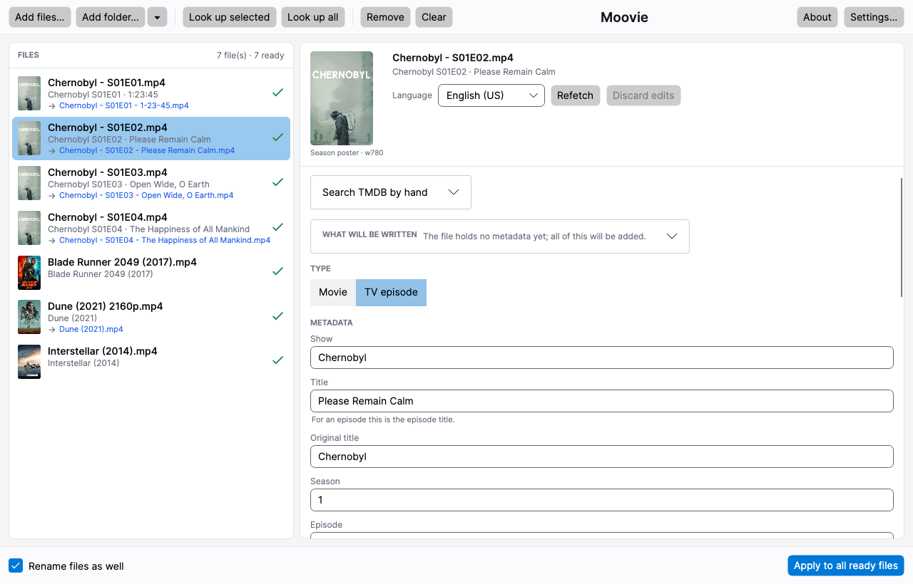
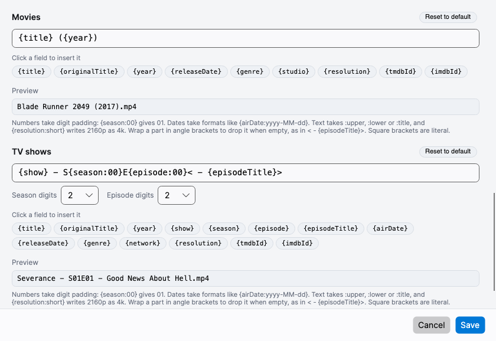

<h1 align="center">
  
  <br>
  Moovie
</h1>

<p align="center">
  <a href="https://github.com/EliotFerragni/Moovie/actions/workflows/build.yml"></a>
  
</p>

Fills the metadata of movie and TV files from
[The Movie Database](https://www.themoviedb.org). Drop files in, review what was matched,
correct anything that is wrong, then write it all in one go.

Runs on **Windows, macOS and Linux** as a single self-contained executable: nothing to
install, no .NET needed on the machine. It can also run headless and serve its interface to a
browser, which is what makes it usable on a NAS.

Only `.mp4` and `.m4v` files are handled.

---

## Getting started

1. **Get a TMDB API key.** Create a free account at
   [themoviedb.org](https://www.themoviedb.org/signup), then go to Settings → API and copy the
   **API Key (v3 auth)**.
2. Open **Settings…** in the app, paste the key, and press **Test key**.
3. Drop some files onto the left pane, or use **Add files…** / **Add folder…**. A folder brings
   in what is inside it, so a whole season can go in at once.
4. Press **Look up all**, or select a few files and press **Look up selected**.
5. Review the list, sorting out anything marked `?` or `✕`.
6. Press **Apply to all ready files**.

Adding files does not look them up: dropping a folder is how files get into the list, not a
decision to spend an API call on every one of them.

**How far a folder is opened** is up to you. The small arrow beside **Add folder…** opens the
choice, with a line explaining it: nothing but what is directly inside the folder, a fixed
number of levels of subfolders, or everything below it. It saves as soon as you pick, and it is
in the window rather than in a file picker, so the desktop and `--web` builds behave alike. The
depth applies to folders however they arrive: added, dropped, or named on the command line. A
file you point at yourself is always taken.

It starts at **This folder only**, deliberately. Pointing a fresh install at the root of a NAS
share is an easy thing to do by accident, and the shallow default means that costs you one
short listing rather than a walk of the whole array. Widen it once you can see what you are
aiming at.

What needs no network happens on adding. Each file is opened, its existing tags are read, its
name is parsed and its video track probed, and the form is filled from all three, **the file's
own tags first**, with the filename supplying only what the file does not have. So a file
tagged by an earlier pass opens showing its own content, cover art included, and there is
something real to review before a single API call. A description that came from the filename
says so with a trailing `?`.

A lookup then replaces those values with TMDB's, keeping anything you typed yourself. Editing a
file before looking it up is a complete path in itself: the edit makes the file ready to apply.
The only thing a file's own tags do not win is the resolution, since the container stores a
coarse HD flag rather than a frame size.

## The window



The left pane lists your files, each with a status icon:

| Icon | Meaning |
|:---:|---|
| ○ | Not looked up yet |
| ✓ | Matched automatically |
| ? | Needs you to choose between candidates |
| ✕ | Nothing on TMDB matches |
| ✎ | Edited by you, ready to apply |
| ✓✓ | Written |
| ⚠ | Something went wrong (the reason is in the preview pane) |

Each row carries the artwork the file will end up with, so a run of episodes from one show
reads as a block and a row that landed on the wrong title stands out. The right pane previews
and edits whatever is selected.

Anything you change by hand is marked with a dot beside its label, including **Type** and the
artwork. **Discard edits** puts the selection back to what TMDB returned, instantly and with no
network. **Refetch** goes back to TMDB and deliberately *keeps* your edits.

**Selecting several files at once** shows the fields they have in common, with `(multiple
values)` where they differ. Typing into a field applies it to every selected file. Fields that
are inherently per-file (episode number, TMDB id) go read-only rather than stamping one value
across a whole season.

**Light or dark** follows the operating system, and **Appearance** in Settings forces one or the
other.

### What will be written

Before anything is written, the pane reads the tags the file already carries and shows them
beside what the lookup returned:

```
WHAT WILL BE WRITTEN    9 field(s) will change
```

Expanding it lists the fields as two columns, **In this file** and **From TMDB**, with the one
**Apply** will write outlined. Click the other to swap them. That is the point of the section: a
lookup is usually right about most fields and wrong about one, and picking through it field by
field beats accepting all of it or none. The cover art row shows both images, which is the only
way to tell a replacement worth making from one that swaps a good cover for a worse one.

A value that applying would empty is struck through and marked *(cleared)*, which is how
switching a file from episode to movie shows the show name being wiped rather than doing it
quietly. A field you typed by hand matches neither column, so the row spells out what will be
written underneath.

## Filenames it understands

Movies:

```
Inception.2010.1080p.BluRay.x264-SPARKS.mp4     → Inception (2010)
Dune.Part.Two.2024.2160p.WEB-DL.DDP5.1.mp4     → Dune Part Two (2024)
Amelie (2001) [1080p] [YTS.AG].mp4             → Amelie (2001)
Blade.Runner.2049.2017.1080p.mp4               → Blade Runner 2049 (2017)
Movies/Arrival (2016)/video.mp4                → Arrival (2016)
```

TV episodes:

```
Breaking.Bad.S01E01.1080p.BluRay.mp4           → Breaking Bad S01E01
Friends - 3x14 - The One With....mp4           → Friends S03E14
Doctor Who Season 4 Episode 10.mp4             → Doctor Who S04E10
Firefly.S01E01-E02.1080p.mp4                   → Firefly S01E01-E02
The.Daily.Show.2021.03.08.mp4                  → located by air date
Breaking Bad/Season 02/04 - Down.mp4           → Breaking Bad S02E04
Shows/Andor/S01E04.1080p.mp4                   → Andor S01E04
```

A year in the title is not mistaken for the release year (`Blade Runner 2049` keeps its 2049,
`1917` stays whole), and words that are both release markers and real title words survive
(`Charlotte's Web`, `The Italian Job`, `Uncut Gems`). Where the filename gives nothing away the
folder tree is consulted: a `Season 02` parent settles the season, and a placeholder like
`video.mp4` falls back to the containing folder.

If a name still defeats the parser, the preview pane has a free-text TMDB search and a box for
pasting a TMDB id. Both work across a selection: when a whole show has matched the wrong
series, select every episode and search once, and each file keeps its own season and episode
numbers while fetching its own entry.

## Renaming

Renaming is off by default. Turn it on with the checkbox at the bottom of the window and the
file list shows `→ new name` under each file before anything happens. Movies and TV shows get
their own template, both editable in Settings with a clickable field palette, digit spinners
and a live preview, so everyday adjustments need no knowledge of the syntax.



```
Movies:    {title} ({year})
TV shows:  {show} - S{season:00}E{episode:00}< - {episodeTitle}>
```

**Fields**

`{title}` `{originalTitle}` `{year}` `{show}` `{season}` `{episode}` `{episodeTitle}`
`{airDate}` `{releaseDate}` `{genre}` `{studio}` `{network}` `{resolution}` `{tmdbId}`
`{imdbId}` `{ext}`

**Formats**

| Kind | Syntax | Result |
|---|---|---|
| Digits | `{season:0}` `{season:00}` `{episode:000}` | `1` · `01` · `007` |
| Dates | `{airDate:yyyy-MM-dd}` `{releaseDate:yyyy}` | `2021-03-08` · `2017` |
| Text | `{title:upper}` `{title:lower}` `{title:title}` | case conversion |
| Short | `{resolution:short}` | `2160p` → `4k` · `4320p` → `8k` |

**Optional parts.** Wrap a section in angle brackets and it disappears when the fields inside
are empty, so a show with no episode title on TMDB gives `Severance - S01E01` rather than a
dangling ` - `. Square brackets are left free for the common style:

```
{title} ({year})< [{resolution}]>   →   Blade Runner 2049 (2017) [2160p].mp4
```

Write `{{` and `}}` for literal braces.

**You do not have to remember any of this.** Hover a field in the palette and it lists the
forms worth writing it in, against what each would produce for the sample below the box. A
field is only offered a format that can change its value, which is why the year is not shown
three ways of being padded. Anything left out is still accepted, so no template that already
works stops working.

**Multi-episode files** repeat the episode marker, so `E{episode:00}` renders as `E01-E02`, the
form media servers recognise.

**Not every resolution is worth naming.** Settings has **Leave the resolution out**: pick
`576p and below` and anything at or under it renders as nothing, while 720p and up are written
as usual.

```
{title} ({year})< [{resolution}]>

  2160p  →  Blade Runner 2049 (2017) [2160p].mp4
   576p  →  Blade Runner 2049 (2017).mp4
```

The token comes out empty, so the optional `<…>` section takes the brackets and the space with
it; a bare `[{resolution}]` would leave the empty brackets. The live preview shows a second
line at the threshold whenever one is set, so you can see which of the two you have written.
This is a naming preference only: the resolution is still read from the video, still shown in
the preview pane, and still decides the HD flag written into the file.

**Characters Windows will not take** (`\ / : * ? " < > |`) are dealt with whatever platform you
are on, since a library is rarely read from only one. Settings has **Unsupported characters**
for what goes in their place: nothing, a space, a dot, an underscore or a dash.

```
Face/Off (1997)   →   FaceOff (1997).mp4     nothing, the default
                  →   Face-Off (1997).mp4    a dash
```

A colon is the one exception and always becomes a dash, because it usually separates a title
from its subtitle: `Mission: Impossible` reads as `Mission - Impossible` rather than running the
two together or leaving a stray mark behind.

**Any one file can be named by hand.** The `→ new name` in the file list is a box, not a label:
type over it and that file takes the name you gave it, whatever the template says. It goes
through the same character rules, so what the row shows afterwards is what the file will get,
and it survives a refetch in another language. The ↺ beside it hands the file back to its
template, and applying clears the name once the file is carrying it.

Renaming happens in place, so only the filename changes and never the folder, and name
collisions get a ` (2)` suffix.

## Artwork

The image at the top of the preview pane is the one that will be embedded, downloaded at the
size set in Settings, so nothing is a stand-in. The caption names what you are looking at, e.g.
`Season poster · w780`.

**Click the artwork to pick a different one.** That lists everything TMDB has for the title:
episode stills, season posters, show posters and backdrops, with the one in use outlined. A
hand-picked image lasts until the file is refetched or you choose a different match.

Which kind gets chosen for you is a setting, separately for TV episodes (episode still, season
poster, show poster or show backdrop) and for movies (poster or backdrop). Plenty of older
episodes have no still, so a missing kind falls back to the next best one rather than leaving
the file bare.

## Languages

Two separate languages, deliberately: wanting a French interface with English metadata, or the
reverse, is an ordinary thing to want.

**The interface** is English, French, German or Italian, set in Settings, following the
operating system by default. It is applied at startup, so changing it asks for a restart.

**The metadata** language is what gets fetched from TMDB. Set a default in Settings; any single
file can be switched and refetched, which is useful when a title has no translation in your
usual language. A refetch keeps every field you edited by hand, and where TMDB has no
translation for a field it is filled from English and labelled *filled in from English*, so a
blank-looking translation is never a mystery.

## What gets written into the file

The iTunes-style MP4 atoms that Plex, Jellyfin, Emby, Infuse and the Apple TV app read:

- `stik`: media type, 9 for a movie and 10 for an episode. This one matters most: without it
  players ignore the TV atoms entirely.
- `©nam` title · `©day` date · `©gen` genres · `desc` and `ldes` descriptions · `covr` cover art
- `tvsh` show · `tvsn` season · `tves` episode · `tven` episode id · `tvnn` network
- `©ART` / `aART` artist · `©alb` album (`Show, Season 1` for episodes) · `©wrt` writer
- `hdvd` HD flag, from the frame size of the video itself
- `iTunMOVI`: an Apple property list holding cast, directors and screenwriters
- `iTunEXTC`: the certification string Apple devices display

Every write is verified by re-reading the file. If it fails, that file is marked and the batch
carries on. Switching a file between movie and episode clears the atoms of the other kind, so
no stale season numbers are left behind. There is an optional "keep a `.bak` copy" setting for
the cautious.

## Running it on a server

The app usually opens a window. It can instead run with no window at all and serve that same
window to a browser:

```bash
Moovie --web                       # every interface, port 8080
Moovie --web --port 9000 /media    # a port of your own, with a folder already loaded
Moovie --web --host 192.168.1.50   # one interface only
```

Then open `http://<that machine>:8080/` in a tab.

**The app runs on the server, not in your browser.** That is the point of the mode and what
makes it useful for a NAS: the file list, the tag writer and the rename engine all act on the
machine serving the page, so **Add files…** browses *its* disks through the app's own file
browser.

Two things to know before relying on it. **It is one session, not one per viewer**: every tab
shows the same app in the same state and each can drive it, so two people at once will fight
over the same cursor. And **it is sized for a LAN** rather than the open internet, since frames
are pictures and scrolling a long list is genuinely expensive. Nothing authenticates the page
either, so it belongs behind whatever already guards the machine.

**On a phone or a tablet** the page is driven by touch. A tap is a click and a double tap is a
double click, which is how the file browser goes into a folder. A drag scrolls whatever is under
your finger, and holding a finger still for a moment before dragging does what dragging with a
mouse does: it selects text, and it moves a scroll bar's thumb. The window is fitted to the
part of the screen the browser actually leaves visible, so the footer and its **Apply** button are
where they belong rather than off the bottom. Typing has to ask for the keyboard: tap into a field
and a **⌨ Keyboard** button appears at the bottom of the page, which raises it. That is a browser
rule rather than a choice, since only a field of the browser's own may raise a keyboard and every
field you can see here is a picture. It goes away by itself as soon as you tap something that is
not a field.

**Copy and paste use your own machine's clipboard**, not the server's. Ctrl+C, Ctrl+X and Ctrl+V
work in the fields as they do in any other tab, and text copied here can be pasted into anything
else on your desk. The field's own right-click menu works too, with one wrinkle: a browser
only lets a page put text on the clipboard for a gesture it has just handled, and the menu's click
was answered on the other side of the wire, so its *Copy* is asking a favour. Firefox grants it,
and Chrome's rule for this is the same; where a browser refuses, that copy still works within the
app, and Ctrl+C is the way out that never depends on it. The API key field is never copied from at
all, exactly as on the desktop.

Left running with nobody connected it does nothing and costs nothing: it draws only in answer to
input, and it wakes about once every ten seconds, so it is not a process that keeps a NAS out of
its idle states or its fan turning. Work already under way is not affected by closing the tab,
so an apply started before you walked away finishes at full speed.

**On Windows**, two things differ. The executable is a Windows application with no console of
its own, so the command prompt returns immediately and output appears after the new prompt.
And Windows will not let a program running as an ordinary user listen on an address until it
has been reserved, so the first run reports what to do:

```
netsh http add urlacl url=http://+:8080/ user=Everyone
```

Run that once from an administrator prompt and `--web` works as an ordinary user from then on.

### On a NAS, in Docker

Every release carries a loadable image for both architectures,
`moovie-<version>-amd64.docker.tar.gz` and `moovie-<version>-arm64.docker.tar.gz`, so the usual
path is to download the one that matches the NAS.

To build one yourself, `build/package-docker.sh` produces the same file. No registry is involved
either way, and the NAS never needs the source or the .NET SDK.

```bash
./build/package-docker.sh              # for this machine's architecture
./build/package-docker.sh arm64        # for an ARM NAS
```

Copy the resulting `dist/moovie-<version>-<arch>.docker.tar.gz` (about 90 MB) to the NAS and
load it:

```bash
docker load -i moovie-1.0.0-arm64.docker.tar.gz

docker run -d --name moovie \
  -p 8080:8080 \
  -v /volume1/media:/media \
  -v /volume1/docker/moovie:/config \
  --user "$(id -u):$(id -g)" \
  moovie:1.0.0
```

**Match the architecture to the NAS**, not to the machine building the image. `uname -m` on the
NAS says which: `x86_64` means `amd64`, `aarch64` means `arm64`. Building for the other one
produces an image that loads and then refuses to run.

**Set `--user`, and make it numeric and the NAS's own.** A bind mount passes ids straight
through and the container knows nothing of the host's user list, so `1000:1000` being right on
a desktop says nothing about a NAS, where media is often owned by a user above 1024 in group
`users` (gid 100). Ask the media itself, on the NAS:

```bash
stat -c '%u:%g' /volume1/media
```

Your library is safer than you might expect without it: tags are written through the file that
is already there and renaming is a rename, so both keep the file's inode and with it its owner
and mode. What does not survive is anything *new*, since a `.bak` copy and `settings.json` come
out owned by whoever is running. That last one has a sting in its tail: run once as root, add
`--user` later, and the app can no longer write its own settings file. Setting it from the
start avoids both.

#### With compose

Synology's Container Manager and QNAP's Container Station both prefer a compose file. Copy
`docker/compose.yaml` to the NAS, change the two volume paths and the user, then:

```bash
docker compose up -d       # start it, or pick up a newly loaded image
docker compose logs -f     # what it is doing
docker compose down        # stop it and remove the container
```

**Load the image first.** There is no registry behind `moovie:1.0.0`, so on a machine that has
not loaded it, compose fails with a pull error rather than building anything.

Upgrading is: build a new tarball, `docker load` it on the NAS, then `docker compose up -d`
again. The tag now points at a different image, so compose recreates the container. Both
volumes outlive that, so the TMDB key and the rename templates stay where they are.

On Synology you can do the same without a shell: Container Manager, Project, Create, and point
it at the folder holding `compose.yaml`.

---

## Building it yourself

Releases carry ready-made binaries for all six targets. To build from source, or to work on the
app, see [DEVELOPMENT.md](DEVELOPMENT.md).

The app accepts paths on the command line, so it also works as an "Open with" target:

```bash
Moovie ~/Videos/Season\ 02
```

macOS builds are unsigned, so Gatekeeper needs persuading once:

```bash
xattr -dr com.apple.quarantine "Moovie.app"
```

---

This project was written by [Claude Code](https://claude.com/claude-code); see
[DEVELOPMENT.md](DEVELOPMENT.md#built-with-claude-code).

This product uses the TMDB API but is not endorsed or certified by TMDB.
